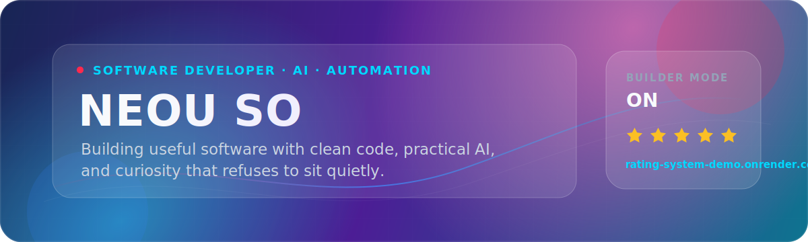
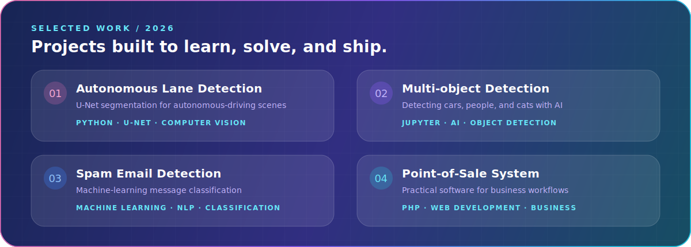

  

## Hi, I'm Neou 👋

I'm **Neou So**, a software developer who enjoys building practical products with **AI, computer vision, automation, and backend technologies**. I turn ideas into working software, learn from real-world results, and keep improving the details that make a product useful.

> **Software Developer** focused on Applied AI, Computer Vision, Automation, and Backend Systems.

🌱 **Learning** by building real products &nbsp;·&nbsp; 🧠 **Exploring** practical AI &nbsp;·&nbsp; ⚡ **Automating** repetitive work

## Tools I build with

## Selected work

  

[Lane Detection](https://github.com/soneou/Autonomous-Lane-Detection-U-Net) · [Object Detection](https://github.com/soneou/car_person_cat_object_detection) · [Spam Detection](https://github.com/soneou/spam_email_detection) · [POS System](https://github.com/soneou/POS-System-with-PHP) · [All projects →](https://github.com/soneou?tab=repositories)

## Activity at a glance

  
  

  

## Let's build something useful

I’m always interested in practical software, applied AI, and opportunities to build something valuable.

  

